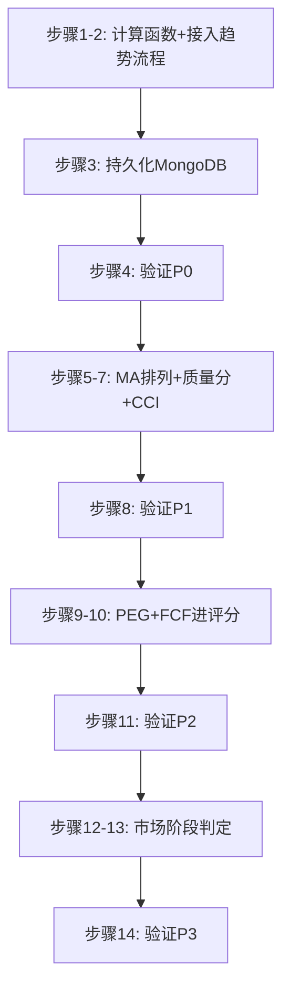

# mystock 补全缺失指标 — 分步实现方案

> 参考项目：`/Users/zhizhong/code/githubProject/daily_stock_analysis`（下称 DSA）
> 目标项目：当前工作区 `mystock`
> 原则：所有新指标先进入数据层（MongoDB `stock_trends` / `stock_factors`），再进入评分/信号闭环，最后进入展示层。每步可独立验证、可回滚。

---

## 总览

| 阶段 | 指标 | 参考实现（DSA） | 落地位置（mystock） |
|---|---|---|---|
| P0 | ATR(20) | `src/services/screening/daily.py` `_atr_20_pct()` | `scripts/market_data_provider.py` |
| P0 | 乖离率 BIAS(MA5/10/20) | `src/stock_analyzer.py` `_calculate_bias()` | `scripts/market_data_provider.py` |
| P0 | 量比 volume_ratio | `daily.py` `_volume_ratio_20d()` | `scripts/market_data_provider.py` |
| P0 | 20日最大回撤（独立字段） | `daily.py` `_max_drawdown_pct()` | `scripts/market_data_provider.py` |
| P1 | MA 多头/空头排列 | `daily.py` `ma_bullish` | `scripts/market_data_provider.py` |
| P1 | 日K数据质量分 | `daily.py` `_compute_daily_quality()` | `scripts/market_data_provider.py` |
| P1 | CCI | `src/services/alert_indicators.py` `_evaluate_cci()` | `scripts/market_data_provider.py` |
| P2 | PEG（补配置已声明但未实现的指标） | 无（DSA 也没有，自行实现） | `scripts/pyramid_multifactor_strategy.py` |
| P2 | FCF/净利润 进评分 | 无（mystock 导入层已有 `free_cash_flow`） | `scripts/pyramid_multifactor_strategy.py` |
| P3 | 市场阶段判定 | `src/services/market_structure_service.py` | 新文件 `scripts/market_phase.py` |

---

## 阶段 P0：技术面风险指标（数据层）

### 步骤 1：在 `market_data_provider.py` 新增指标计算函数

在 `scripts/market_data_provider.py` 的技术指标计算区域（`_kdj` / `_rsi` / `_macd` / `_bollinger` 附近，约 line 980-1050）新增 4 个静态方法：

**1.1 ATR(20)**（参考 DSA `daily.py:1094` `_atr_20_pct`）：

```python
@staticmethod
def _atr(highs, lows, closes, n=20):
    """平均真实波幅 ATR(n)，返回绝对值和占收盘价百分比。"""
    if len(highs) < n + 1:
        return None, None
    trs = []
    for i in range(1, len(highs)):
        tr = max(
            highs[i] - lows[i],
            abs(highs[i] - closes[i - 1]),
            abs(lows[i] - closes[i - 1]),
        )
        trs.append(tr)
    atr = sum(trs[-n:]) / n
    last_close = closes[-1]
    atr_pct = atr / last_close * 100 if last_close > 0 else None
    return atr, atr_pct
```

**1.2 乖离率 BIAS**（参考 DSA `stock_analyzer.py:394` `_calculate_bias`）：

```python
@staticmethod
def _bias(closes, ma_period):
    """(Close - MA) / MA * 100"""
    if len(closes) < ma_period:
        return None
    ma = sum(closes[-ma_period:]) / ma_period
    if ma <= 0:
        return None
    return (closes[-1] - ma) / ma * 100
```

**1.3 量比**（参考 DSA `daily.py:1062` `_volume_ratio_20d`）：

```python
@staticmethod
def _volume_ratio(volumes, n=20):
    """当日成交量 / 前 n 日均量"""
    if len(volumes) < 2:
        return None
    prev = volumes[-(n + 1):-1]
    valid = [v for v in prev if v and v > 0]
    if not valid:
        return None
    base = sum(valid) / len(valid)
    return volumes[-1] / base if base > 0 else None
```

**1.4 20日最大回撤**（参考 DSA `daily.py:1085` `_max_drawdown_pct`）：

```python
@staticmethod
def _max_drawdown(closes, n=20):
    """近 n 日最大回撤百分比（负值）"""
    window = closes[-n:] if len(closes) >= n else closes
    if len(window) < 2:
        return None
    peak = window[0]
    max_dd = 0.0
    for c in window:
        peak = max(peak, c)
        if peak > 0:
            max_dd = min(max_dd, c / peak - 1.0)
    return max_dd * 100
```

### 步骤 2：接入趋势计算主流程

在 `market_data_provider.py` 的趋势计算入口（约 line 921-951，`_rsi/_macd/_bollinger/_kdj` 被调用的函数）中：

```python
atr_val, atr_pct = self._atr(highs, lows, closes)
bias_ma5 = self._bias(closes, 5)
bias_ma10 = self._bias(closes, 10)
bias_ma20 = self._bias(closes, 20)
volume_ratio = self._volume_ratio(volumes)
max_drawdown_20d = self._max_drawdown(closes, 20)
```

并把结果加入返回 dict（line 946-951 附近）：

```python
"atr_20": round(atr_val, 3) if atr_val else None,
"atr_20_pct": round(atr_pct, 2) if atr_pct else None,
"bias": {
    "ma5": round(bias_ma5, 2) if bias_ma5 is not None else None,
    "ma10": round(bias_ma10, 2) if bias_ma10 is not None else None,
    "ma20": round(bias_ma20, 2) if bias_ma20 is not None else None,
},
"volume_ratio": round(volume_ratio, 2) if volume_ratio else None,
"max_drawdown_20d_pct": round(max_drawdown_20d, 2) if max_drawdown_20d is not None else None,
```

### 步骤 3：持久化到 MongoDB `stock_trends`

修改 `scripts/precompute_history.py`（line 173-178 附近，趋势字段写入处），在写入 dict 中追加：

```python
"atr_20_pct": ti.get("atr_20_pct"),
"bias_ma5": (ti.get("bias") or {}).get("ma5"),
"bias_ma10": (ti.get("bias") or {}).get("ma10"),
"bias_ma20": (ti.get("bias") or {}).get("ma20"),
"volume_ratio": ti.get("volume_ratio"),
"max_drawdown_20d_pct": ti.get("max_drawdown_20d_pct"),
```

同时更新 `scripts/buy_plan.py`（line 468-519）和 `scripts/sector_radar.py`（line 145-147）的 MongoDB projection，把新字段查出来。

### 步骤 4：验证 P0

```bash
# 语法检查
PYTHONPYCACHEPREFIX=/tmp/mystock_pycache python3 -m compileall -q scripts
# 单票验证（跑一次趋势计算，肉眼检查新字段）
python3 scripts/precompute_history.py --codes 600519 --stage trends
# 用 mongo shell 检查
mongosh --eval 'db.stock_trends.findOne({code:"600519"}, {atr_20_pct:1, bias_ma5:1, volume_ratio:1, max_drawdown_20d_pct:1})'
```

---

## 阶段 P1：结构判定与数据质量

### 步骤 5：MA 排列判定

参考 DSA `daily.py:882`（`ma_bullish = last_ma5 >= last_ma20 >= last_ma60`），在 `market_data_provider.py` 趋势返回中加：

```python
ma5, ma20, ma60 = ...  # 已有 MA 计算
if ma5 and ma20 and ma60:
    if ma5 >= ma20 >= ma60:
        ma_alignment = "bullish"      # 多头排列
    elif ma5 <= ma20 <= ma60:
        ma_alignment = "bearish"      # 空头排列
    else:
        ma_alignment = "mixed"        # 混合
else:
    ma_alignment = None
```

写入 `stock_trends.ma_alignment`，并在 `scripts/entry_engine.py`（line 42-46，读取 trend_signal 处）增加排列条件：`bullish` 排列给趋势分加成，`bearish` 排列一票否决反转买入。

### 步骤 6：日K数据质量分

参考 DSA `daily.py:937` `_compute_daily_quality`，在 `market_data_provider.py` 新增：

```python
@staticmethod
def _daily_quality_score(closes, highs, lows, volumes, stale=False):
    """0-100 分。数据点不足/缺列/非法 OHLC/stale 缓存扣分。"""
    score = 100.0
    flags = []
    n = len(closes)
    if n < 30:
        score -= 35; flags.append("short_history_lt30")
    elif n < 60:
        score -= 15; flags.append("short_history_lt60")
    # OHLC 合法性：high >= max(open,close), low <= min(open,close)
    # （mystock 的 K 线来自腾讯/新浪，需逐条校验）
    # stale 判断：最新日期距今超过 3 个交易日
    if stale:
        score -= 25; flags.append("stale_cache")
    return round(max(score, 0.0), 1), ";".join(flags)
```

写入 `stock_trends.daily_quality_score`。在 `buy_plan.py` 候选组装处（line 550 附近）：`daily_quality_score < 60` 的候选降权或剔除。

### 步骤 7：CCI 指标

参考 DSA `alert_indicators.py:327` `_evaluate_cci`，在 `market_data_provider.py` 新增：

```python
@staticmethod
def _cci(highs, lows, closes, n=14):
    """CCI(n)。TP=(H+L+C)/3, CCI=(TP-MA(TP))/(0.015*mean_deviation)"""
    if len(closes) < n:
        return None
    tps = [(h + l + c) / 3 for h, l, c in zip(highs, lows, closes)]
    window = tps[-n:]
    tp_ma = sum(window) / n
    mean_dev = sum(abs(tp - tp_ma) for tp in window) / n
    if mean_dev == 0:
        return None
    return (tps[-1] - tp_ma) / (0.015 * mean_dev)
```

写入 `stock_trends.cci14`。用途：`cci < -100` 作为超卖辅助确认，与现有 RSI/KDJ 超卖判断形成多指标共振（在 `entry_engine.py` 的 reversal 评分中，CCI<-100 且回升时 +0.05）。

### 步骤 8：验证 P1

```bash
python3 -m compileall -q scripts
python3 scripts/precompute_history.py --codes 600519,000001 --stage trends
# 检查 ma_alignment / daily_quality_score / cci14 字段
```

---

## 阶段 P2：补齐"配置已声明但未实现"的基本面指标

### 步骤 9：PEG 计算（轻资产成长组）

**9.1 数据来源**：`stock_factors` 已有 `pe`（TTM）和 `forecast_min/forecast_max`（一致预期增速）。

**9.2 实现**：在 `scripts/pyramid_multifactor_strategy.py` 的估值评分区（line 197-290 附近）新增：

```python
# PEG = PE / 预期增速（用 forecast_min/max 中值，保守取 min）
peg = None
pe_val = stock.get('pe')
fc_min = (financial or {}).get('forecast_min') or stock.get('forecast_min')
fc_max = (financial or {}).get('forecast_max') or stock.get('forecast_max')
if pe_val and pe_val > 0 and fc_min is not None and fc_max is not None:
    growth = max((fc_min + fc_max) / 2, 1.0)  # 增速下限 1% 防止除零爆炸
    peg = pe_val / growth
    peg_scoring = scoring.get('peg', {})
    scores['peg'] = self._score_metric(peg, peg_scoring, higher_is_better=False)
    details['peg'] = round(peg, 2)
```

**9.3 配置**：`config/轻资产成长.yaml` 的 `scoring` 段加阶梯（与现有 `pe` 阶梯同格式）：

```yaml
peg:
  excellent: 0.5   # ≤0.5 满分
  good: 1.0
  average: 1.5
  poor: 2.5
```

这样 line 103 的信号灯 `metric: "peg"` 就有真实数据支撑了。

### 步骤 10：FCF/净利润 进质量评分

mystock 的 `factor_data_import_service.py:898` 已计算 `free_cash_flow`，只需在 `pyramid_multifactor_strategy.py` 质量评分区（line 758-792，`gross_margin`/`debt_to_assets`/`ocf_to_net_income` 旁边）新增：

```python
# 自由现金流/净利润（盈利质量，越高越好）
fcf = financial.get('free_cash_flow') if financial else None
ni = financial.get('net_income') if financial else None
if fcf is not None and ni and ni > 0:
    fcf_ratio = fcf / ni
    fcf_scoring = scoring.get('fcf_to_net_income', {})
    scores['fcf_to_net_income'] = self._score_metric(fcf_ratio, fcf_scoring, higher_is_better=True)
    details['fcf_to_net_income'] = round(fcf_ratio, 2)
```

四个组的 yaml `scoring` 段各加：

```yaml
fcf_to_net_income:
  excellent: 0.8
  good: 0.5
  average: 0.2
  poor: 0.0
```

### 步骤 11：验证 P2

```bash
python3 -m compileall -q scripts
# 跑一次多因子，检查报告中出现 PEG 和 FCF/NI
python3 scripts/pyramid_multifactor_strategy.py --codes 600519
# 确认轻资产成长组的 peg 信号灯不再恒为黄/灰
```

---

## 阶段 P3：市场阶段判定（可选，工程量最大）

### 步骤 12：新建 `scripts/market_phase.py`

参考 DSA `src/services/market_structure_service.py` 的思路，但 mystock 不需要那么重，做一个轻量版：

**输入**（mystock 已有全部数据）：
- 市场宽度：`buy_plan.py:559` 的站上 MA20 比例
- 北向/南向：`market_data_provider.py:1843` `_get_north_bound_flow()`
- 两融：`market_data_provider.py` margin 数据
- 指数动量：沪深300/恒生指数 20日收益

**输出**：`{"phase": "accumulation|markup|distribution|decline", "confidence": 0-1, "evidence": [...]}`

判定规则（简化版 Wyckoff 阶段）：

```python
def determine_market_phase(breadth, index_momentum_20d, north_flow_5d, margin_trend):
    score = 0
    evidence = []
    if breadth > 0.55: score += 1; evidence.append(f"宽度{breadth:.0%}偏强")
    if index_momentum_20d > 3: score += 1; evidence.append("指数20日动量>3%")
    elif index_momentum_20d < -3: score -= 1; evidence.append("指数20日动量<-3%")
    if north_flow_5d and north_flow_5d > 0: score += 1; evidence.append("北向5日净流入")
    if margin_trend == "up": score += 1; evidence.append("两融余额上升")

    if score >= 3: return {"phase": "markup", ...}        # 上升期：正常执行买入计划
    if score == 2: return {"phase": "accumulation", ...}  # 筑底期：只允许低吸场景
    if score == 0 or score == 1: return {"phase": "distribution", ...}  # 分配期：减仓优先
    return {"phase": "decline", ...}                      # 下跌期：暂停新买入
```

### 步骤 13：接入 buy_plan 和 portfolio_strategy

- `buy_plan.py`：在生成候选前调用 `determine_market_phase()`，`phase == "decline"` 时输出"市场阶段：下跌期，暂停生成买入候选"并提前返回；`accumulation` 时只保留低吸场景候选。
- `portfolio_strategy.py`：在风控报告头部输出当前市场阶段和证据链。

### 步骤 14：验证 P3

```bash
python3 -m compileall -q scripts
python3 scripts/buy_plan.py  # 检查输出头部有市场阶段
python3 scripts/portfolio_strategy.py  # 检查风控报告含阶段判定
```

---

## 实施顺序与依赖关系



## 风险与注意事项

1. **MongoDB 字段兼容**：新字段用 `None` 兜底，旧文档读出来 `get()` 返回 None 不会崩；不要改已有字段名。
2. **precompute 全量重算成本**：P0/P1 新字段需要重跑 `precompute_history.py` 的 trends 阶段，建议先单票验证再全量。
3. **PEG 的增速口径**：`forecast_min/max` 是 Tushare 业绩预告的变动幅度（%），与 PE 相除时注意单位（growth 已经是百分数数值，如 20 表示 20%，直接 `pe/growth` 即可）。
4. **信号灯 metric 对齐**：`config/轻资产成长.yaml:103` 的 `metric: "peg"` 要求 details 里的 key 必须叫 `peg`，实现时保持一致。
5. **不要动 `config_complete.yaml` 的密钥**：那是另一个待办（应迁环境变量），本方案不涉及。
